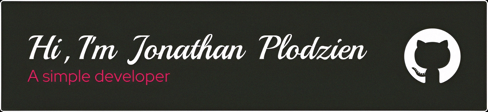

<h4>Hi, I'm Jonathan. I'm a full- stack developer with 4 years of experience. I enjoy building sites & apps. My focus is React (Next.js, app router).</h4>

 

  

  

## 👨‍💻 Portfolio

All of my projects and experiences are available at **https://jonathan-plodzien-portfolio.vercel.app/**

## 📫 Contact with me

  
  
  

<h2>
  <svg xmlns="http://www.w3.org/2000/svg" width="23" height="23" viewBox="0 -4 25 25"><path fill="currentColor" d="M12 10.11c1.03 0 1.87.84 1.87 1.89c0 1-.84 1.85-1.87 1.85S10.13 13 10.13 12c0-1.05.84-1.89 1.87-1.89M7.37 20c.63.38 2.01-.2 3.6-1.7c-.52-.59-1.03-1.23-1.51-1.9a23 23 0 0 1-2.4-.36c-.51 2.14-.32 3.61.31 3.96m.71-5.74l-.29-.51c-.11.29-.22.58-.29.86c.27.06.57.11.88.16zm6.54-.76l.81-1.5l-.81-1.5c-.3-.53-.62-1-.91-1.47C13.17 9 12.6 9 12 9s-1.17 0-1.71.03c-.29.47-.61.94-.91 1.47L8.57 12l.81 1.5c.3.53.62 1 .91 1.47c.54.03 1.11.03 1.71.03s1.17 0 1.71-.03c.29-.47.61-.94.91-1.47M12 6.78c-.19.22-.39.45-.59.72h1.18c-.2-.27-.4-.5-.59-.72m0 10.44c.19-.22.39-.45.59-.72h-1.18c.2.27.4.5.59.72M16.62 4c-.62-.38-2 .2-3.59 1.7c.52.59 1.03 1.23 1.51 1.9c.82.08 1.63.2 2.4.36c.51-2.14.32-3.61-.32-3.96m-.7 5.74l.29.51c.11-.29.22-.58.29-.86c-.27-.06-.57-.11-.88-.16zm1.45-7.05c1.47.84 1.63 3.05 1.01 5.63c2.54.75 4.37 1.99 4.37 3.68s-1.83 2.93-4.37 3.68c.62 2.58.46 4.79-1.01 5.63c-1.46.84-3.45-.12-5.37-1.95c-1.92 1.83-3.91 2.79-5.38 1.95c-1.46-.84-1.62-3.05-1-5.63c-2.54-.75-4.37-1.99-4.37-3.68s1.83-2.93 4.37-3.68c-.62-2.58-.46-4.79 1-5.63c1.47-.84 3.46.12 5.38 1.95c1.92-1.83 3.91-2.79 5.37-1.95M17.08 12c.34.75.64 1.5.89 2.26c2.1-.63 3.28-1.53 3.28-2.26s-1.18-1.63-3.28-2.26c-.25.76-.55 1.51-.89 2.26M6.92 12c-.34-.75-.64-1.5-.89-2.26c-2.1.63-3.28 1.53-3.28 2.26s1.18 1.63 3.28 2.26c.25-.76.55-1.51.89-2.26m9 2.26l-.3.51c.31-.05.61-.1.88-.16c-.07-.28-.18-.57-.29-.86zm-2.89 4.04c1.59 1.5 2.97 2.08 3.59 1.7c.64-.35.83-1.82.32-3.96c-.77.16-1.58.28-2.4.36c-.48.67-.99 1.31-1.51 1.9M8.08 9.74l.3-.51c-.31.05-.61.1-.88.16c.07.28.18.57.29.86zm2.89-4.04C9.38 4.2 8 3.62 7.37 4c-.63.35-.82 1.82-.31 3.96a23 23 0 0 1 2.4-.36c.48-.67.99-1.31 1.51-1.9"/></svg>
  Frontend Technologies
</h2>

  
  
  
  
  
  
  
  
  

<h2>
  <svg xmlns="http://www.w3.org/2000/svg" width="23" height="23" viewBox="0 -4 25 25"><path fill="currentColor" d="M12 1.85c-.27 0-.55.07-.78.2l-7.44 4.3c-.48.28-.78.8-.78 1.36v8.58c0 .56.3 1.08.78 1.36l1.95 1.12c.95.46 1.27.47 1.71.47c1.4 0 2.21-.85 2.21-2.33V8.44c0-.12-.1-.22-.22-.22H8.5c-.13 0-.23.1-.23.22v8.47c0 .66-.68 1.31-1.77.76L4.45 16.5a.26.26 0 0 1-.11-.21V7.71c0-.09.04-.17.11-.21l7.44-4.29c.06-.04.16-.04.22 0l7.44 4.29c.07.04.11.12.11.21v8.58c0 .08-.04.16-.11.21l-7.44 4.29c-.06.04-.16.04-.23 0L10 19.65c-.08-.03-.16-.04-.21-.01c-.53.3-.63.36-1.12.51c-.12.04-.31.11.07.32l2.48 1.47q.36.21.78.21t.78-.21l7.44-4.29c.48-.28.78-.8.78-1.36V7.71c0-.56-.3-1.08-.78-1.36l-7.44-4.3c-.23-.13-.5-.2-.78-.2M14 8c-2.12 0-3.39.89-3.39 2.39c0 1.61 1.26 2.08 3.3 2.28c2.43.24 2.62.6 2.62 1.08c0 .83-.67 1.18-2.23 1.18c-1.98 0-2.4-.49-2.55-1.47a.226.226 0 0 0-.22-.18h-.96c-.12 0-.21.09-.21.22c0 1.24.68 2.74 3.94 2.74c2.35 0 3.7-.93 3.7-2.55c0-1.61-1.08-2.03-3.37-2.34c-2.31-.3-2.54-.46-2.54-1c0-.45.2-1.05 1.91-1.05c1.5 0 2.09.33 2.32 1.36c.02.1.11.17.21.17h.97c.05 0 .11-.02.15-.07c.04-.04.07-.1.05-.16C17.56 8.82 16.38 8 14 8"/></svg>
  Backend Technologies
</h2>

  
  
  

<h2>
  <svg xmlns="http://www.w3.org/2000/svg" width="23" height="23" viewBox="0 -4 25 25"><path fill="currentColor" d="M12 11q3.75 0 6.375-1.175T21 7t-2.625-2.825T12 3T5.625 4.175T3 7t2.625 2.825T12 11m0 2.5q1.025 0 2.563-.213t2.962-.687t2.45-1.237T21 9.5V12q0 1.1-1.025 1.863t-2.45 1.237t-2.962.688T12 16t-2.562-.213t-2.963-.687t-2.45-1.237T3 12V9.5q0 1.1 1.025 1.863t2.45 1.237t2.963.688T12 13.5m0 5q1.025 0 2.563-.213t2.962-.687t2.45-1.237T21 14.5V17q0 1.1-1.025 1.863t-2.45 1.237t-2.962.688T12 21t-2.562-.213t-2.963-.687t-2.45-1.237T3 17v-2.5q0 1.1 1.025 1.863t2.45 1.237t2.963.688T12 18.5"/></svg>
  Databases
</h2>

  
  
  

<h2>⚙️ Other Technologies and Tools</h2>

  
  
  
  
  

<h2>✨ Stars</h2>

  

    
    
  

  

    
  

<h2>📊 Statistics</h2>
  

    

      
      
    

    

      
      
    

    

      
    

  

<h2>⚡Activity Graph:</h2>

  

